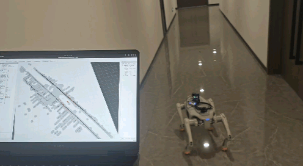

# Agibot D1 四足机器人室内导航系统

[](https://docs.ros.org/en/humble/)
[](https://ubuntu.com/)
[](https://isocpp.org/)
[](https://www.python.org/)
[](https://github.com/hku-mars/FAST_LIO)
[](https://www.livoxtech.com/)
[](https://navigation.ros.org/)
[](LICENSE)

基于 ROS 2 的 Agibot D1 四足机器人室内导航系统，集成 FAST-LIO2 SLAM、Livox Mid360 激光雷达和 Nav2 导航框架。

## 📷 项目展示

<table>
  <tr>
    <td></td>
    <td></td>
  </tr>
  <tr>
    <td align="center"><b>室内导航</b></td>
    <td align="center"><b>室外导航</b></td>
  </tr>
</table>

<table width="100%" border="0" cellpadding="0" cellspacing="0">
  <tr>
    <!-- 每列固定50%宽度 -->
    <td width="50%" style="padding: 5px;">
      
    </td>
    <td width="50%" style="padding: 5px;">
      
    </td>
  </tr>
  <tr>
    <td align="center"><b>避障测试</b></td>
    <td align="center"><b>参与证明</b></td>
  </tr>
</table>

## 🎯 主要特性

- **实时 SLAM**：使用 FAST-LIO2 进行精确定位和建图
- **3D 激光雷达支持**：集成 Livox Mid360 激光雷达
- **室内导航**：基于 AMCL 定位和 Nav2 路径规划
- **2D 建图**：使用 SLAM Toolbox 创建 2D 占据栅格地图
- **键盘控制**：支持手动遥操作
- **安全特性**：自动管理机器人姿态（站立/趴下）

## 🛠️ 系统架构

```
┌─────────────────────────────────────────────────────────┐
│                      导航层                              │
│  ┌──────────┐  ┌──────────┐  ┌────────────────────┐   │
│  │  Nav2    │  │  AMCL    │  │  地图服务器        │   │
│  │ 路径规划 │  │  定位    │  │  (预建地图)        │   │
│  └──────────┘  └──────────┘  └────────────────────┘   │
└─────────────────────────────────────────────────────────┘
                          ↓
┌─────────────────────────────────────────────────────────┐
│                   SLAM 与感知层                          │
│  ┌──────────┐  ┌──────────┐  ┌────────────────────┐   │
│  │FAST-LIO2 │  │点云转激光│  │  SLAM Toolbox      │   │
│  │  SLAM    │  │  扫描    │  │  (建图模式)        │   │
│  └──────────┘  └──────────┘  └────────────────────┘   │
└─────────────────────────────────────────────────────────┘
                          ↓
┌─────────────────────────────────────────────────────────┐
│                      硬件层                              │
│  ┌──────────┐  ┌──────────┐  ┌────────────────────┐   │
│  │ Livox    │  │ 机器人   │  │  键盘              │   │
│  │ Mid360   │  │ 控制     │  │  遥操作            │   │
│  └──────────┘  └──────────┘  └────────────────────┘   │
└─────────────────────────────────────────────────────────┘
```

## 📋 环境要求

### 硬件要求
- 支持 SDK 的四足机器人
- Livox Mid360 激光雷达
- 运行 Ubuntu 22.04 的计算平台（ARM64）

### 软件要求
- Ubuntu 22.04
- ROS 2 Humble
- 依赖包安装：
  ```bash
  sudo apt update
  sudo apt install -y \
    ros-humble-navigation2 \
    ros-humble-nav2-bringup \
    ros-humble-slam-toolbox \
    ros-humble-robot-localization \
    ros-humble-pointcloud-to-laserscan
  ```

## 🚀 快速开始

### 1. 克隆和编译

```bash
# 克隆仓库
git clone https://github.com/2648800581/quadruped-indoor-navigation.git
cd quadruped-indoor-navigation

# 编译工作空间
./build.sh
```

### 2. 创建地图（首次使用）

```bash
# 启动建图模式
./mapping.sh

# 在另一个终端，控制机器人探索环境
ros2 run d1_dog_control keyboard_teleop_node

# 建图完成后保存地图
./save_map.sh maps/my_map
```

### 3. 运行导航

```bash
# 使用你的地图启动导航
./run.sh --map maps/my_map

# 在 RViz2 中：
# 1. 使用 "2D Pose Estimate" 设置初始位姿
# 2. 使用 "2D Goal Pose" 设置导航目标
```

## 📦 功能包说明

### 核心功能包

- **d1_dog_control**：机器人控制接口和键盘遥操作
- **FAST_LIO**：快速激光雷达惯性里程计，用于实时 SLAM
- **livox_ros_driver2**：Livox Mid360 激光雷达驱动

### 启动文件

- `livox_mid360.launch.py`：启动激光雷达驱动
- `fast_lio.launch.py`：启动 FAST-LIO2 SLAM
- `pointcloud_to_laserscan.launch.py`：将 3D 点云转换为 2D 激光扫描
- `slam_toolbox.launch.py`：启动 2D SLAM 建图
- `nav2_indoor.launch.py`：启动 Nav2 导航框架

## 🎮 键盘控制

运行 `keyboard_teleop_node` 时，使用以下按键：

- `w` - 前进
- `s` - 后退
- `a` - 左移
- `d` - 右移
- `q` - 左转
- `e` - 右转
- `x` - 停止
- `Ctrl+C` - 退出

## 📁 项目结构

```
.
├── src/                      # ROS 2 功能包
│   ├── d1_dog_control/       # 机器人控制包
│   ├── FAST_LIO/             # FAST-LIO2 SLAM
│   └── livox_ros_driver2/    # Livox 激光雷达驱动
├── launch/                   # 启动文件
├── config/                   # 配置文件
├── rviz/                     # RViz2 配置
├── maps/                     # 保存的地图
├── scripts/                  # 工具脚本
├── build.sh                  # 编译脚本
├── mapping.sh                # 建图模式脚本
├── run.sh                    # 导航模式脚本
└── save_map.sh               # 地图保存脚本
```

## ⚙️ 配置说明

### 激光雷达配置
编辑 `config/MID360_config.json` 配置 Livox Mid360 激光雷达的网络设置。

### FAST-LIO2 参数
调整 `config/fast_lio_mid360.yaml` 进行 SLAM 调优：
- 点云滤波参数
- IMU 参数
- 建图分辨率

### 导航参数
修改 `config/nav2_params_indoor.yaml` 配置：
- 路径规划行为
- 障碍物避障
- 控制器参数

## 🔧 故障排除

### 激光雷达未检测到
```bash
# 检查激光雷达网络连接
ping 192.168.X.X  # Livox 默认 IP

# 验证 ROS 话题
ros2 topic list | grep livox
```

### FAST-LIO2 未发布数据
```bash
# 检查 IMU 数据是否可用
ros2 topic echo /livox/imu --once

# 验证点云数据
ros2 topic echo /livox/lidar --once
```

### 导航不工作
```bash
# 确保地图已加载
ros2 topic echo /map --once

# 检查 AMCL 定位
ros2 topic echo /amcl_pose --once
```

## 🤝 贡献

欢迎贡献！请随时提交 Pull Request。

## 📄 许可证

本项目采用 MIT 许可证 - 详见 LICENSE 文件。

## 🙏 致谢

- [FAST-LIO2](https://github.com/hku-mars/FAST_LIO) - 快速激光雷达惯性里程计
- [Livox SDK](https://github.com/Livox-SDK/livox_ros_driver2) - Livox 激光雷达 ROS 2 驱动
- [Nav2](https://navigation.ros.org/) - ROS 2 导航框架
- [SLAM Toolbox](https://github.com/SteveMacenski/slam_toolbox) - ROS 2 的 2D SLAM

## 📮 联系方式

如有问题和支持需求，请在 GitHub 上提交 Issue。

---

**注意**：这是一个研究/开发项目。在真实环境中操作机器人时，请确保采取适当的安全措施。
